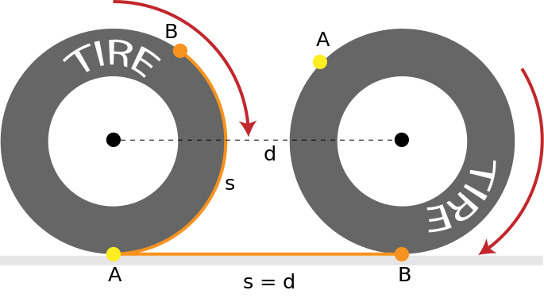
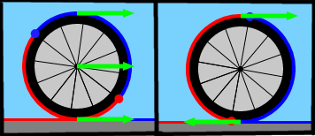
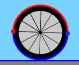

# Documentation for Wheel object

**note - from here on out. the examples and files in this repo will not be updated. For updating info and code for the wheel object, as well as, working examples, please check out the scient-library repo.**

The wheel object is for demonstrating rotational motion. It includes displaying vectors of parts of motion and displaying the visual nature of a non-slippling rim of length S in comparison to floor distance D.



## Creating the Wheel:
To make a wheel use the following code:
```javascript
var my_wheel = new wheel(_x,_y,_d);
```
#### where...
+ _x = x position of the center of the wheel.
+ _y = y position of the center of the wheel.
+ _d = the diameter of the wheel object.

This will create a wheel object. To draw the object call the following in the draw() function:
```javascript
my_wheel.draw();
```

## Spinning the wheel:
the above code will create a wheel object. However, you will notice that the wheel does not spin. To make the wheel spin you must set the rotate variable to true.
```javascript
my_wheel.rotate = true;
```
To save extra computing work, just call this once in the setup() function if you don't want the wheel to stop rotating.

## Wheel Decorations:

### Vector Decorations

Let's say that you think just a spinning wheel is too plain. There are a couple of ways to spice it up. The first thing that you can do is to show arrows on the wheel that demonstrate different vectors involved with the wheel's motion.

#### for example:
+ translation
+ rotation
+ spinning w/o slipping

To add a vector decoration, use the following:
```javascript
my_wheel.vdecorate = true;
```

Here are some of the vector decorations that you can draw.

\

(note) currently only one of the following types of vector decorations work. It is the responsibility of the user to make sure that all of the decoration options that you do not want displayed be set to *false*. 

to display translation arrows use the following:
```javascript
my_wheel.translation = true;
```

to display rotation arrows use the following:

```javascript
my_wheel.rotation = true;
```

### Color Decorations
The other type of decoration that you could use is **color decor** which lets you keep track of when exactly half of the circle has rotated.



to use **color decorations** set the cdecorate to true like so:
```javascript
my_wheel.cdecorate = true;
```

(note) by default the color decor is turned on.
